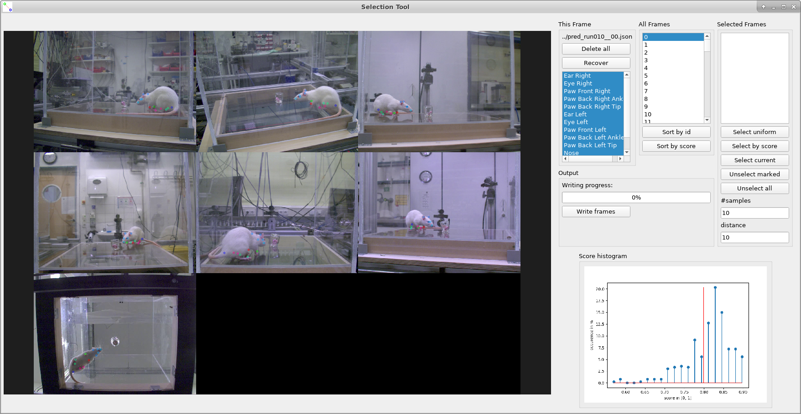

# Selection Tool

The selection tool is used for

- In detail inspection of predictions the network made
- Selecting erronous predictions for further labeling

    

## Overview

- On its left hand side of the tool one time step of the video data is shown
- Images recorded simultaneous by the cameras are shown in a tiled view
- On the right hand side of the tool various controls are offered:
    
    - 'This frame'
        - Gives control over which keypoints are shown by selecting them, by default all keypoints are shown
        - 'Delete all': Discards all predicted keypoints, i.e. the annotator should label all of them later on
        - 'Recover': Can Undo delete all, by loading the predictions
    - 'All frames'
        - Selects the time step shown
        - Allows sorting by id (i.e. in the order they were recorded) or by score (i.e. how confident the networks prediction was)
        
    - 'Selected frames'
        - Selected frames are shown in the initially empty list
        - Provides automatic selection tools ('Select uniform' or 'Select by score')
        
    - 'Output'
        - Once 'write frames' is clicked the selected frames are grabbed from video input and stored to disk
        - In the folder the selected video was located a new directory is created that contains the selected frames
        - The tool chooses the first folder of the format 'labeled_set%d' that does not exist yet for storage (i.e. labeled_set0, labeles_set1, ...)
        
    - 'Score histogram':
        - Shows the distribution of prediction scores over the sequence shown, ranging from not confident (0.0) to very confidente (1.0)
        - The red vertical line indicates where the current frame is located

## Starting the tool

For starting the selection tool a model configuration file `{MODEL_CFG}` must be provided (so the tool knows which keypoint
are defined and how to show them) as well as an indication towards the data that should be shown `{DATA_PATH}`

    python select.py {MODEL_CFG} {DATA_PATH}
    
For example the largest part of the tutorials uses the rat model so
 
    {MODEL_CFG}=config/model_rat.cfg.json

If predictions are already made for a video sequence, the corresponding prediction file can be specified by `{DATA_PATH}`,
f.e. it could look something like

    {DATA_PATH}=data/pred_run000__01.json
    
If there aren't any predictions for the videos available yet, f.e. because it is the initial run of a new task, 
then `{DATA_PATH}` is set as path to one of the videos constituting the sequence

    {DATA_PATH}=data/pred_run000_cam1.avi
    
If you need to adapt the appearance of the Selection tool towards your screen setting please see 'frame_size' in `config/viewer.cfg.json`

If you need to deviate from the assumed default layout on how calibration files are located (`M.json` in the **path** of `{DATA_PATH}`),
you can call select.py using the --calib_file argument, which specifies the path to the calibration file wrt the **path** of `{DATA_PATH}`.

## Using the tool

- 'Mouse wheel': Zooming in and out of the left hand side frames
- 'Left mouse button': Translating the frames shown left, right, up or down. (Usually, used when zoomed in)
- 'Right mouse button': Delete a prediction. It is deleted from all frames with one click.
- 'Arrow right', ->: Next frame
- 'Arrow left', <-: Previous frame
- 'S': Select current frame
- 'W': Write selected frames to disk
